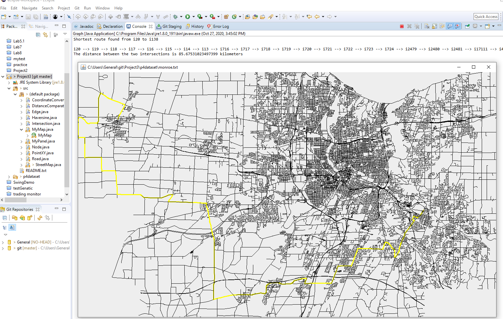

## Description 
This project implements a rudimentary mapping program in Java. Given a data set representing the roads  
and intersections in a specific geographic region, the program should be able to plot a map of the data and  
provide shortest path directions between any two arbitrary intersections.

## Input Data
The geographical data necessary to run the program is provided in the format of a tab-delimited text files.
Each line will consist of 4 pieces of data, as defined below:

* Intersections start with “i”, followed by a unique string ID, and decimal representations of latitude and longitude.
* i IntersectionID Latitude Longitude
* Roads start with “r”, followed by a unique string ID, and the IDs of the two intersections it connects.
r RoadID Intersection1ID Intersection2ID

 Three different data sets are provided 
 *  ur.txt represents a subset of the pedestrian sidewalks on UR campus. 
 *  monroe.txt is census data for Monroe County, NY.
 *  nys.txt is census data on roads in New York State.  
## Output 

## Implementation
 
In this project, I use my own graph implementation. I have classes for both node and edges. Compared to a generic implementation, my
node classes also store a latitude and longitude, and my edge class uses the Haversine formula to calculate its own weight. As I was
familiar with Dijkstra's algorithm beforehand, implementing it was not too difficult. I used a PriorityQueue based on minimum distance
from the source node. What was difficult was the StackOverFlow errors I got from the PriorityQueue. I solved this by limiting the size of
my PriorityQueue to 100 so it would not overload. It would break out of the while loop if its size was larger than 100. 

Swing is used to draw maps. There are a few challenges.
  1. To convert langtitude and longitude to X and y. I have used a method called  Projection to implement the conversion. 
  2. shrink the map without losing precision.  Scaling Factor is used to shrink the size so it fits in computer screen.

## List of Files
**CoordinateConverter.java** :  used to converts coordinates to point on map  
**DistanceComparator.java** Used in the PriorityQueue to find the node with the minimum distance from the source.  
**Edge.java Edge** implementation that also uses Haversine formula
**Haversine.java** Code from online using Haversine formula to convert latitude/longitude to a distance  
**Intersection.java** object holds intersection information  
**MyMap.java** JFrame object  
**MyPanel.java**  Jpanel  
**Node.java** Node implementation  
**PointXY.java**  point object for map  
**Road.java**  store road info for map  
**StreetMap.java**  Driver class that reads file, holds Dijkstra methods, and holds graph  

## Runtime Analysis
O(V^2)

## How to run the program 
To compile  
   javac StreetMap.java    

To run  
java StreetMap ur.txt  --directions GLEASON-HALL GILBERT-LONG  --show                   //direction and map  
java StreetMap ur.txt  --show --directions GLEASON-HALL GILBERT-LONG                    //direction only
java StreetMap monroe.txt  --directions i20 i138 --show       
java StreetMap nys.txt  --directions i10 i1834 --show

## Features:  
* Jframe can be resized and map will resize accordingly. 
* map work for all input files.
* Shortest path works well with UR campus.
* out of memory error when input files are too big.
